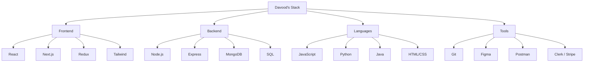

<!-- GLITCH EFFECT HEADER -->
<p align="center">
  
</p>

<!-- MATRIX STYLE LOADING -->
<p align="center">
  
</p>

---

## 🌐 Connect With Me

<p align="center">
  <a href="https://linkedin.com/in/shaikdavood">
    
  </a>
  <a href="https://davoodportfolio.vercel.app">
    
  </a>
  <a href="mailto:shaik.davoodbasha2@gmail.com">
    
  </a>
  <a href="https://github.com/shaikdavoodbasha">
    
  </a>
</p>

---

## 💻 Terminal Intro

```bash
┌─[davood@github]─[~]
└──╼ $ whoami
> Shaik Davood Basha - Frontend Developer & MERN Stack Enthusiast

┌─[davood@github]─[~]
└──╼ $ location
> India 🌏

┌─[davood@github]─[~]
└──╼ $ skills --list
> React | Next.js | Node.js | MongoDB | TypeScript | Tailwind

┌─[davood@github]─[~]
└──╼ $ status
> Currently building: Full-Stack Learning Management System 🚀
```

---

# 💼 Work Experience

<div align="center">

| Company | Role | Highlights |
|-------|-------|-------|
| **GetsYoutThere Solutions** | Frontend Developer Intern (Sep 2025 - Nov 2025) | Document Management System modules, AI integration, responsive components |
| **Finari Services Pvt Ltd** | Frontend Developer Intern (Feb 2024 - May 2024) | Stall setup system, vendor management, CI/CD pipelines |

</div>

---

# 🎯 Project Gallery

| Project | Stack | Description |
|------|------|------|
| 📚 **LMS Platform** | MERN, Clerk, Stripe | Full-stack learning platform with payments |
| 📊 **Crypto Dashboard** | Next.js, CoinGecko API | Live cryptocurrency tracking |
| 🛒 **Ecommerce Next** | Next.js, Stripe | Full-stack ecommerce platform |
| 👕 **Modern Clothing Store** | React, Tailwind | Clean UI clothing store |

---

## 🛠️ Tech Stack



---

# 📈 GitHub Stats

<div align="center">


</div>

---

# 🐍 Contribution Graph

<div align="center">


</div>

---

# 🏅 Certifications

<p align="center">


</p>

---

# 🎯 Random Dev Quote

<p align="center">


</p>

---

# 📞 Contact

```javascript
const contactOptions = {
  preferred: ["Email", "LinkedIn"],
  responseTime: "Within 24 hours",
  openTo: ["Full-time roles", "Freelance", "Collaborations"],
  funFact: "I reply faster if you mention your favorite anime!"
};

console.log("Let's build something amazing together 🚀");
```

<p align="center">
<a href="mailto:shaik.davoodbasha2@gmail.com">

</a>
</p>

---

<p align="center">

</p>

<p align="center">

</p>

<p align="center">
⭐ From <a href="https://github.com/shaikdavoodbasha">Shaik Davood Basha</a> — Crafted with 💻 & ☕
</p>
